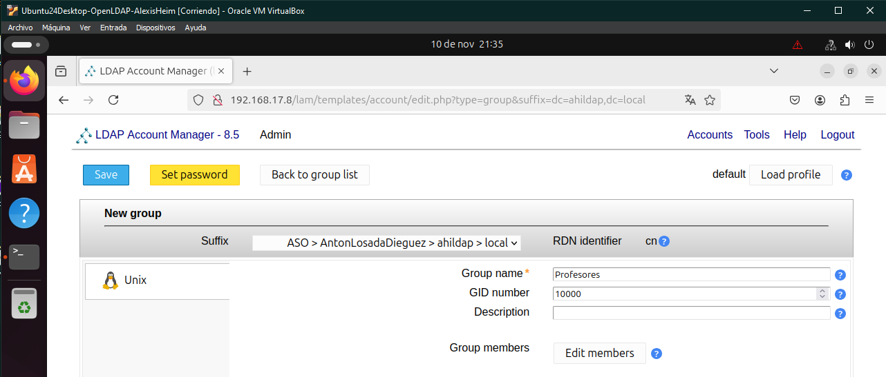
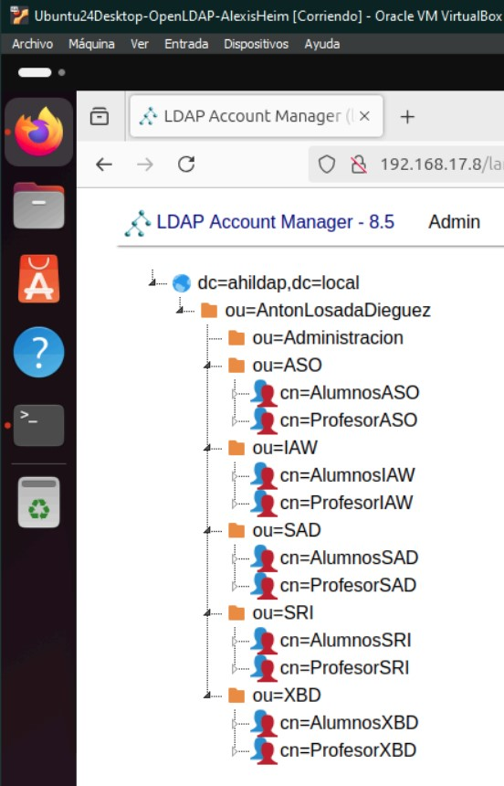
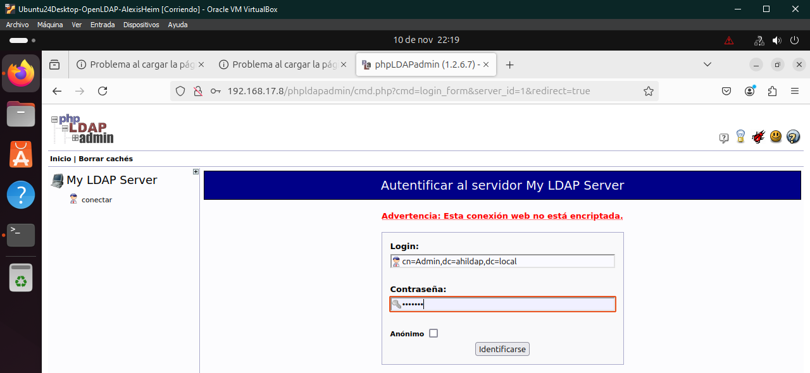
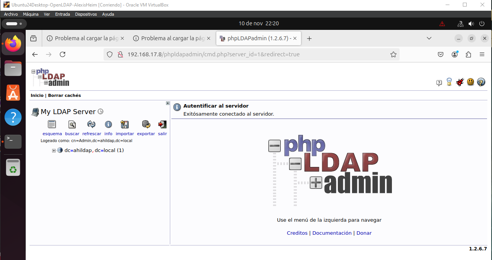

# Actividad 1.2 - LDAP Account Manager y `phpLDAPAdmin` 

## 1 - Instalación de las dependencias necesarias.

### Instalamos los paquetes necesarios con el siguiente comando.

### Para el correcto funcionamiento del programa necesitaremos activar una funcionalidad de php. Para ello verificaremos la versión del mismo e introduciremos el comando para activar el PHP-CGI. Por último reiniciamos el servicio Apache.

## 2 - Configuración del LDAP Account Manager

### Editaremos el siguiente archivo para darle acceso remoto a todos los equipos de la red que indicamos y reiniciamos de nuevo el servicio.

### Accedemos desde el cliente al LDAP Account Manager y entramos en la opción “LAM Configuration” > “Edit general settings” > Y escribimos “lam” en el espacio para la contraseña. Ya dentro del menú, bajaremos al fondo de la página para cambiar la contraseña del master.

### Ahora entraremos en la opción “Edit server profile” (lam es la contraseña por defecto) para hacer las siguientes modificaciones en los campos de List of valid users, treeview y contraseña.

### Volveremos a “Edit server profile”, pero esta vez iremos al apartado “Account Types” y modificaremos los campos “LDAP suffix” de los usuarios y grupos de la siguiente forma.

### Ahora solo quedaría acceder al entorno con el usuario Admin y su contraseña.

## 3 - Eliminar UO anterior.

### Será tan simple como entrar en el apartado Tools > OU editor y en el apartado de Delete seleccionar nuestra antigua UO.

## 4 - Crear UO nueva.

### Creamos las unidades necesarias simplemente indicando el directorio padre y el nombre de la UO.

### Crearemos de la misma forma el resto de unidades organizativas.

### El resultado sería algo así.

## 5 - Crear grupos nuevos.

### La mecánica de creación de grupos será muy similar a la de crear unidades organizativas.

### El resultado final de la inclusión de grupos sería el siguiente.

## 5 - Crear usuarios nuevos.

### Crearemos un par de usuarios de ejemplo. Dentro del apartado de creación iremos a la opción Unix y ahí indicaremos los datos del usuario, su uid y su grupo.

### Quedando el resultado de la siguiente forma.

## 6 - Instalación y configuración de phpLDAPadmin.

### Intalamos el programa.

### Ahora configuramos su archivo .conf para indicarle nuestro dominio.

### Nos conectaremos desde el cliente y le daremos clic en el botón “conectar”.

## 7 - Crear una UO nueva.

### Iremos al lugar indicado en la captura y le daremos clic al botón de crear nuevo objeto y seleccionaremos la opción “Genérico: Unidad Organizativa”.

