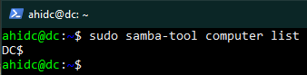

# Samba 4 AD en Ubuntu Server

## 0 – Configuración previa de las máquinas.

### Configuraremos 3 tarjetas de red en la máquina virtual. Una en modo “NAT”, para conectarse a los servicios de internet. Una en modo “Red Interna”, para que el servidor y los clientes se puedan comunicar entre sí. Una en modo “Puente” para poder usar la máquina server desde la máquina local a través de SSH.

### Configuración del perfil de usuario del servidor en la instalación.

### Ya terminada la instalación, accederemos a la máquina servidor mediante SSH. Pero para ello, instalaremos el SSH en el servidor y lo habilitaremos con los siguientes comandos.

`~$ sudo apt install ssh –y`

`~$ sudo systemctl start ssh`

`~$ sudo systemctl status ssh`

### Procederemos a conectarnos a la máquina servidor desde nuestro equipo local (PowerShell) con el siguiente comando.

`~$ssh ahidc@192.168.1.167`

### A partir de aquí todos los comandos serán ejecutados desde el equipo local. 

### Configuraremos un archivo .yaml para establecer una IP fija en nuestro servidor con los siguientes comandos.

`~$ sudo nano /etc/netplan/01-netcgf.yaml`

### El archivo debe quedar tal que así:

`~$ sudo cat /etc/netplan/01-netcgf.yaml`

### Aplicaremos los permisos pertinentes al archivo .yaml.

`~$ sudo chmod 600 /etc/netplan/01-netcgf.yaml`

### Aplicaremos los cambios y verificaremos que se han efectuado correctamente.

`~$ sudo netplan apply`

`~$ ip a`

### 10.0.2.15/24 = Tarjeta NAT para conectarse a internet.
### 192.168.17.8/24 = Red Interna para conectarse con los clientes.
### 192.168.1.167/24 = Tarjeta Puente para conectarse al server mediante SSH.

## 1 – Configuración base del servidor.

### Lo primero que haremos será cambiar el host de nuestro servidor.

`~$ sudo hostnamectl set-hostname dc`

### Lo siguiente será establecer el FQDN de nuestro servidor samba, para ello modificaremos el siguiente archivo tal como se muestra en la captura:

`~$ sudo nano /etc/hosts`

`~$ sudo cat /etc/hosts`

### Verificaremos que el cambio se ha hecho correctamente haciendo un ping a nuestro servidor Samba.

`~$ ping dc.ubuntuserverdc.local`

### Desactivaremos el servicio system-resolved y eliminaremos su enlace simbólico. Esto lo haremos por una incompatibilidad con el servidor Samba.

`~$ sudo systemctl disable --now systemd-resolved`

`~$ sudo unlink /etc/resolv.conf`

### Ya con el resolv.conf eliminado crearemos uno de cero para hacerlo compatible con el Samba. El resultado del archivo será el siguiente:

`~$ sudo nano /etc/resolv.conf`

### Ahora solo quedará hacer inmutable el archivo para que este no se pueda modificar.

`~$ sudo chattr +i /etc/resolv.conf`

## 2 - Instalación del Samba.

### Instalaremos todos los paquetes y dependencias del samba con el siguiente comando e indicaremos la siguiente información en la autenticación de Kerberos.

`~$ sudo apt install -y acl attr samba samba-dsdb-modules samba-vfs-modules smbclient winbind libpam-winbind libnss-winbind libpam-krb5 krb5-config krb5-user dnsutils chrony net-tools`

`~$ UBUNTUSERVERDC.LOCAL`

`~$ DC.UBUNTUSERVERDC.LOCAL`

`~$ DC.UBUNTUSERVERDC.LOCAL`

### Detendremos los servicios smbd, nmbd y winbind dado que el Samba no los requiere para trabajar correctamente.

`~$ sudo systemctl disable --now smbd nmbd winbind`

### Por el contrario, activaremos el samba-ac-dc. El servidor Samba solo necesita esto para funcionar.

`~$ sudo systemctl unmask samba-ad-dc`

`~$ sudo systemctl enable samba-ad-dc`

## 3 - Configuración del Samba.

### Ejecutaremos el comando de configuración y escribiremos lo siguiente:

`~$ sudo samba-tool domain provision`

### Esto generará un nuevo smb.conf

`~$ sudo cat /etc/samba/smb.conf`

### Es posible que la primera vez salga un error. Para solventarlo será tan simple como borrar el smb.conf ya existente y lanzar de nuevo el comando de configuración.

`~$ sudo rm /etc/samba/smb.conf`

### Si lo consideramos necesario podemos crear una copia de seguridad de la configuración predeterminada de Kerberos.

`~$ sudo mv /etc/krb5.conf /etc/krb5.conf.orig`

### Reemplazamos el siguiente archivo, iniciaremos el servicio de Samba Active Directory y comprobaremos el estado del mismo.

`~$ sudo cp /var/lib/samba/private/krb5.conf /etc/krb5.conf`

`~$ sudo systemctl start samba-ad-dc`

`~$ sudo systemctl status samba-ad-dc`

## 4 - Configuración de sincronización del tiempo.

### Samba Active Directory depende del protocolo Kerberos, y el protocolo Kerberos requiere que los tiempos del servidor AD y de la estación de trabajo estén sincronizados. Para garantizar una sincronización de tiempo adecuada, también deberemos configurar un servidor de Protocolo de tiempo de red (NTP) en Samba.

### Para ello modificaremos los siguientes permisos.

`~$ sudo chown root:_chrony /var/lib/samba/ntp_signd/`

`~$ sudo chmod 750 /var/lib/samba/ntp_signd/`

### Modificaremos el siguiente archivo de configuración para que quede así:

`~$ sudo nano /etc/chrony/chrony.conf`

`~$ sudo cat /etc/chrony/chrony.conf`

### Reiniciamos el servicio chronyd.

`~$ sudo systemctl restart chronyd`
`~$ sudo systemctl status chronyd`

### Haremos las siguientes comprobaciones para saber si todo está correcto Nombres de dominio.

`~$ host -t A ubuntuserverdc.local`
`~$ host -t A dc.ubuntuserverdc.local`

### Registros de kerberos y ldap.>

`~$ host -t SRV _kerberos._udp.ubuntuserverdc.local`

`~$ host -t SRV _ldap._tcp.ubuntuserverdc.local`

### Recursos predeterminados disponibles en Samba

`~$ smbclient -L clockwork.local -N`

### Comprobamos que se puede iniciar sesión en el dc.

`~$ sudo smbclient //localhost/netlogon -U 'administrator'`

### Verificar funcionamiento WINDOWS AD DC 2008

`~$ sudo samba-tool domain level show`

### 5 - Administración de usuarios y grupos.

### Crearemos un usuario samba para ubuntu y listamos a los usuarios. Haremos lo mismo con los grupos.

`~$ sudo samba-tool user create ahiUbuntuClient`

`~$ sudo samba-tool user list`

`~$ samba-tool group add ubuntu`

`~$ samba-tool group list`

### Añadiremos al usuario ahiUbuntuClient al grupo ubuntu.

`~$ samba-tool group addmembers ubuntu ahiUbuntuClient`

### Listaremos las máquinas que están actualmente conectadas al servidor.

`~$ sudo samba-tool computer list`

