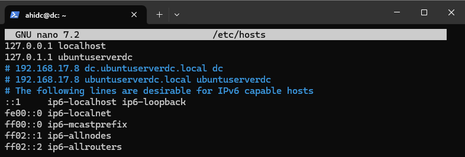
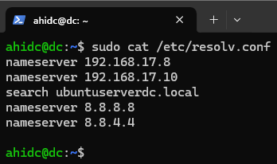
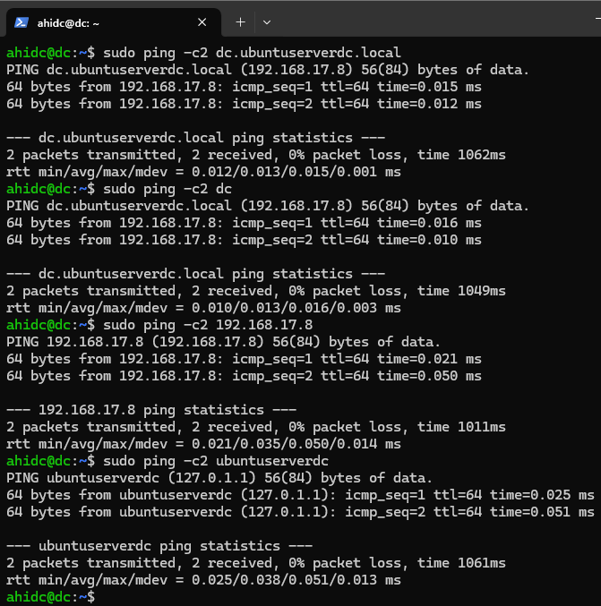
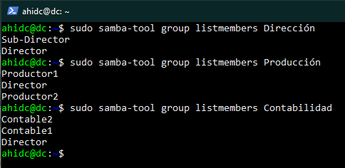
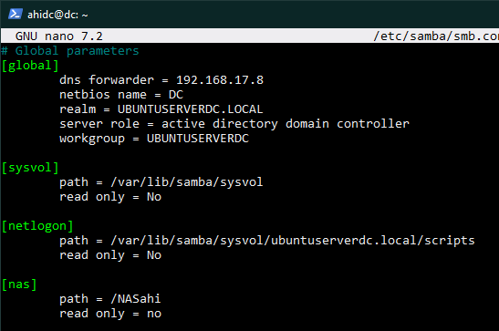

# Actividad 3.2 - Recursos compartidos en Samba 4 AD con Ubuntu Server

## 1 – Deskackear /etc/hosts

### Dado a un excesivo uso de /etc/hosts haremos unos cambios para que se use /etc/resolv para hacer que el servidor sea más eficiente. Para ello, haremos lo siguiente.

### Borraremos todo lo que haga referencia al servidor Samba4 en el archivo hosts. Con simplemente comentar las líneas debería ser suficiente.

`~$ sudo nano /etc/hosts`

### Mientras tanto, el /etc/resolv deberíamos tenerlo así:

`~$ sudo cat /etc/resolv.conf`

### En el caso de que no esté así, le quitaremos el estado inmutable al archivo, lo modificaremos y lo volveremos a hacer inmutable:

`~$ sudo chattr –i /etc/resolv.conf`

`~$ sudo nano /etc/resolv.conf`

`~$ sudo chattr +1 /etc/resolv.conf`

### Ahora probaremos si el servidor sigue resolviendo si le llamamos.

`~$ sudo ping –c2 dc.ubuntuserverdc.local`

`~$ sudo ping –c2 dc`

`~$ sudo ping –c2 ubuntuserverdc`

`~$ sudo ping –c2 192.168.17.8`

## 2 – Infraestructura de AD con samba-tool.

### Crearemos la siguiente infraestructura:

### a) - 3 grupos con por 2 usuarios en cada uno de ellos.

### b) - 1 usuario debe pertenecer a los 3 grupos.

### c) - Debe haber usuarios que pertenezca a 1 solo grupo

### Para ello, usaremos los siguientes comandos:

### Creación de grupos:

`~$ sudo samba-tool group add producción`

`~$ sudo samba-tool group add dirección`

`~$ sudo samba-tool group add contabilidad`

### Creación de usuarios:

`~$ sudo samba-tool user create Director`

`~$ sudo samba-tool user create Sub-Director`

`~$ sudo samba-tool user create Contable1`

`~$ sudo samba-tool user create Contable2`

`~$ sudo samba-tool user create Productor1`

`~$ sudo samba-tool user create Productor2`

### Añadir Director a todos los grupos:

`~$ sudo samba-tool group addmembers dirección Director`

`~$ sudo samba-tool group addmembers producción Director`

`~$ sudo samba-tool group addmembers contabilidad Director`

### Añadir al resto de usuarios a sus respectivos grupos

`~$ sudo samba-tool group addmembers dirección Sub-Director`

`~$ sudo samba-tool group addmembers contabilidad Contable1`

`~$ sudo samba-tool group addmembers contabilidad Contable2`

`~$ sudo samba-tool group addmembers producción Productor1`

`~$ sudo samba-tool group addmembers producción Productor2`

### La infraestructura debería quedar tal que así:

`~$ sudo samba-tool group listmembers Dirección`

`~$ sudo samba-tool group listmembers Producción`

`~$ sudo samba-tool group listmembers Contabilidad`

## 3 - Recursos compartidos.

### Crearemos las carpetas de los recursos compartidos y le pondremos los permisos adecuados a la carpeta.

`~$ mkdir NASahi`

`~$ sudo chmod -R 775 NASahi`

`~$ sudo chown -R root:"domain users" NASahi`

`~$ cd NASahi/`

`~$ sudo mkdir produccion`

`~$ sudo mkdir contabilidad`

`~$ sudo mkdir direccion`

### Ahora configuraremos el samba para que detecte el nuevo nas.

`~$ sudo nano /etc/samba/smb.conf`

### Para terminar de configurar los recursos compartidos solo tendremos que reiniciar el servicio.

`~$ sudo systemctl restart samba-ad-dc.service`
