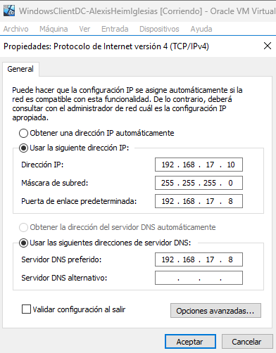
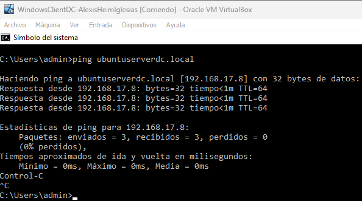
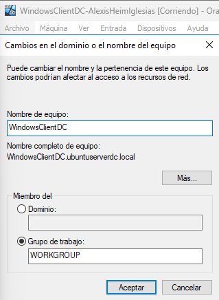
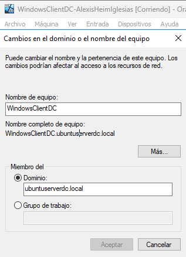
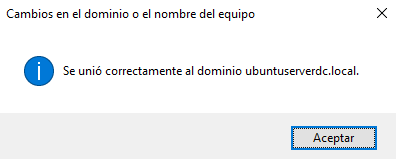
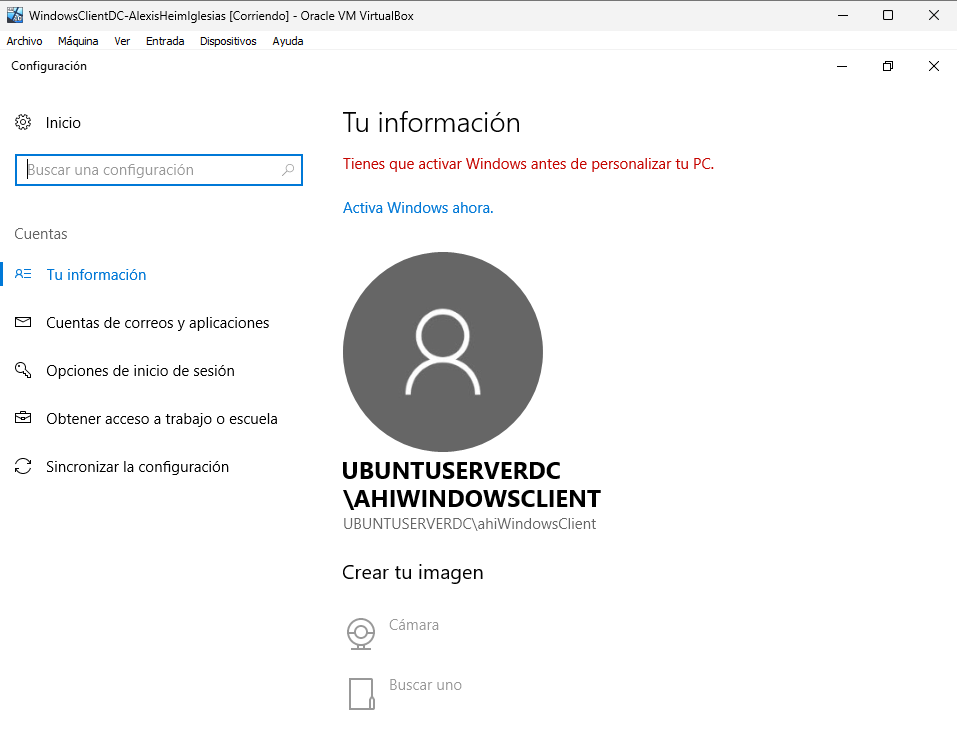

# Actividad 6.1 - Integración de equipos Windows en Samba AD con Ubuntu Server

## 1 – Integrar equipo Windows al servidor Samba.

### Crearemos un usuario en el servidor para que el cliente Windows pueda usarlo.

`~$ sudo samba-tool user create ahiWindowsClient`

### El primer paso para integrar el equipo Windows al dominio será especificarle una configuración de red adecuada para que pueda ver el servidor.

`Explorador de archivos > Red > Propiedades > Ethernet > Propiedades > Protocolo de internet versión 4 (TCP/IPv4)`

### Comprobaremos que el Windows es capaz de comunicarse con el servidor:

`~$ ping ubuntuserverdc.local`

### Ahora le cambiaremos el nombre de host al equipo Windows. Aplicaremos los cambios y reiniciaremos el equipo.
	
`Explorador de archivos > Este equipo > Propiedades > Cambiar configuración > Nombre de equipo > Cambiar > Nombre de equipo.`

### Después de reiniciar el equipo, volveremos al mismo lugar y escribiremos la dirección del dominio en el recuadro 

### De nuevo, aplicaremos los cambios. Nos pedirá las credenciales del dominio, las escribiremos y reiniciaremos el equipo para que integre el equipo correctamente.

### Solo quedaría probar a iniciar la sesión, con el usuario que hemos creado antes, para comprobar que todo funciona correctamente.

